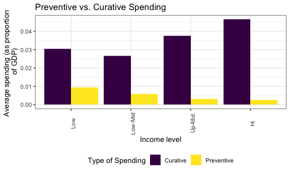
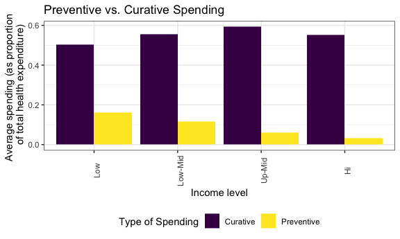
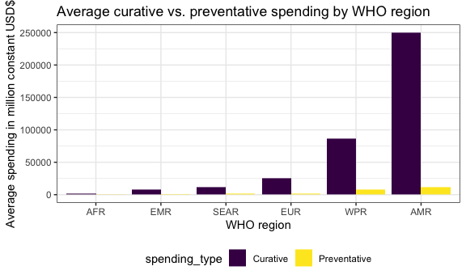
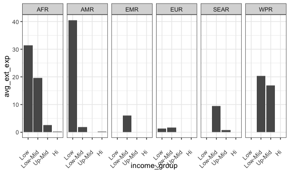

P8105 Final Project
================

## Data Import

``` r
ghed_df <- 
  read_excel("data/GHED_data.XLSX")
```

### Safiya’s section

**Indicators** Primary health care - phc\_usd\_pc  
Infectious disease - dis1\_usd2019  
Noncommunicable disease - dis4\_usd2019  
Preventive care - hc6\_usd2019  
Curative care - hc1\_usd2019  
GDP - gdp\_pc\_usd  
CHE - che\_pc\_usd

**Primary Health Care Spending**

Primary health care spending by income level (USD per capita)

``` r
PHC_df <-
  ghed_df %>% 
    janitor::clean_names() %>% 
    filter(year == 2019) %>% 
    drop_na(phc_usd_pc) %>% 
    group_by(income_group) %>% 
    summarize(
      n_countries = n(),
      avg_phc = mean(phc_usd_pc))

PHC_df %>% 
  ggplot(aes(x = fct_relevel(as.factor(income_group), c("Low", "Low-Mid", "Up-Mid", "Hi")), y = avg_phc,  fill = income_group)) +
  geom_col() +
  labs(
    title = "Primary Health Care Spending",
    x = "Income level",
    y = "Average PHC spending (per capita USD)"
  ) + 
  theme(axis.text.x = element_text(angle = 90)) +
  theme(legend.position = "none")
```


Primary health care spending by income level (as as proportion of per
capita GDP)

``` r
PHC_df <-
  ghed_df %>% 
    janitor::clean_names() %>% 
    filter(year == 2019) %>% 
    drop_na(phc_usd_pc, gdp_pc_usd) %>% 
    group_by(income_group) %>% 
    summarize(
      n_countries = n(),
      avg_phc = mean(phc_usd_pc / gdp_pc_usd))

PHC_df %>% 
  ggplot(aes(x = fct_relevel(as.factor(income_group), c("Low", "Low-Mid", "Up-Mid", "Hi")), y = avg_phc,  fill = income_group)) +
  geom_col() +
  labs(
    title = "Primary Health Care Spending",
    x = "Income level",
    y = "Average PHC spending (as proportion of \n per capita GDP)"
  ) + 
  theme(axis.text.x = element_text(angle = 90)) +
  theme(legend.position = "none")
```


Primary health care spending by income level (as a proportion of per
capita health expenditure)

``` r
PHC_df <-
  ghed_df %>% 
    janitor::clean_names() %>% 
    filter(year == 2019) %>% 
    drop_na(phc_usd_pc, gdp_pc_usd) %>% 
    group_by(income_group) %>% 
    summarize(
      n_countries = n(),
      avg_phc = mean(phc_usd_pc / che_pc_usd))

PHC_df %>% 
  ggplot(aes(x = fct_relevel(as.factor(income_group), c("Low", "Low-Mid", "Up-Mid", "Hi")), y = avg_phc,  fill = income_group)) +
  geom_col() +
  labs(
    title = "Primary Health Care Spending",
    x = "Income level",
    y = "Average PHC spending (as proportion of \n per capita health expenditure)"
  ) + 
  theme(axis.text.x = element_text(angle = 90)) +
  theme(legend.position = "none")
```


**Preventive vs. Curative Spending**

Primary health care spending by income level (USD per capita)

``` r
prev_df <-
  ghed_df %>% 
    janitor::clean_names() %>% 
    filter(year == 2019) %>% 
    drop_na(hc6_usd) %>% 
    group_by(income_group) %>% 
    summarize(
      n_countries = n(),
      `Preventive` = mean(hc6_usd2019))

cur_df <-
  ghed_df %>% 
    janitor::clean_names() %>% 
    filter(year == 2019) %>% 
    drop_na(hc1_usd) %>% 
    group_by(income_group) %>% 
    summarize(
      n_countries = n(),
      `Curative` = mean(hc1_usd2019))

prev_cur_df <-
  left_join(prev_df, cur_df) %>% 
  pivot_longer(
    `Preventive`:`Curative`,
    names_to = "Type of Spending",
    values_to = "avg_spend"
  )
```

    ## Joining, by = c("income_group", "n_countries")

``` r
prev_cur_df %>% 
  ggplot(aes(x = fct_relevel(as.factor(income_group), c("Low", "Low-Mid", "Up-Mid", "Hi")), y = avg_spend, fill = `Type of Spending`)) +
  geom_bar(stat = "identity", position = "dodge") +
  labs(
    title = "Preventive vs. Curative Spending",
    x = "Income level",
    y = "Average spending \n (million USD)"
  ) + 
  theme(axis.text.x = element_text(angle = 90))
```


Primary health care spending by income level (as as proportion of GDP)

``` r
prev_df <-
  ghed_df %>% 
    janitor::clean_names() %>% 
    filter(year == 2019) %>% 
    drop_na(hc6_usd, gdp_pc_usd) %>% 
    group_by(income_group) %>% 
    summarize(
      n_countries = n(),
      `Preventive` = mean(hc6_usd2019 / gdp_usd2019))

cur_df <-
  ghed_df %>% 
    janitor::clean_names() %>% 
    filter(year == 2019) %>% 
    drop_na(hc1_usd, gdp_pc_usd) %>% 
    group_by(income_group) %>% 
    summarize(
      n_countries = n(),
      `Curative` = mean(hc1_usd2019 / gdp_usd2019))

prev_cur_df <-
  left_join(prev_df, cur_df) %>% 
  pivot_longer(
    `Preventive`:`Curative`,
    names_to = "Type of Spending",
    values_to = "avg_spend"
  )
```

    ## Joining, by = c("income_group", "n_countries")

``` r
prev_cur_df %>%
  ggplot(aes(x = fct_relevel(as.factor(income_group), c("Low", "Low-Mid", "Up-Mid", "Hi")), y = avg_spend, fill = `Type of Spending`)) +
  geom_bar(stat = "identity", position = "dodge") +
  labs(
    title = "Preventive vs. Curative Spending",
    x = "Income level",
    y = "Average spending (as proportion \n of GDP)"
  ) + 
  theme(axis.text.x = element_text(angle = 90))
```



Primary health care spending by income level (as proportion of health
expenditure)

``` r
prev_df <-
  ghed_df %>% 
    janitor::clean_names() %>% 
    filter(year == 2019) %>% 
    drop_na(hc6_usd, gdp_pc_usd) %>% 
    group_by(income_group) %>% 
    summarize(
      n_countries = n(),
      `Preventive` = mean(hc6_usd2019 / che_usd2019))

cur_df <-
  ghed_df %>% 
    janitor::clean_names() %>% 
    filter(year == 2019) %>% 
    drop_na(hc1_usd, gdp_pc_usd) %>% 
    group_by(income_group) %>% 
    summarize(
      n_countries = n(),
      `Curative` = mean(hc1_usd2019 / che_usd2019))

prev_cur_df <-
  left_join(prev_df, cur_df) %>% 
  pivot_longer(
    `Preventive`:`Curative`,
    names_to = "Type of Spending",
    values_to = "avg_spend"
  )
```

    ## Joining, by = c("income_group", "n_countries")

``` r
prev_cur_df %>%
  ggplot(aes(x = fct_relevel(as.factor(income_group), c("Low", "Low-Mid", "Up-Mid", "Hi")), y = avg_spend, fill = `Type of Spending`)) +
  geom_bar(stat = "identity", position = "dodge") +
  labs(
    title = "Preventive vs. Curative Spending",
    x = "Income level",
    y = "Average spending (as proportion \n of total health expenditure)"
  ) + 
  theme(axis.text.x = element_text(angle = 90))
```



**Infectious vs. Non-communicable Diseases**

### Ragyie’s section

**Indicators for analysis**

-   Curative care, in million constant (2019) US$ —&gt; hc1\_usd2019
-   Preventive care, in million constant (2019) US$ —&gt; hc6\_usd2019
-   Infectious and Parasitic Diseases, in million constant (2019) US$
    —&gt; dis1\_usd2019
-   Noncommunicable Diseases (NCDs), in million constant (2019) US$
    —&gt; dis4\_usd2019
-   Primary Health Care (PHC) Expenditure per Capita in US$ —&gt;
    phc\_usd\_pc
-   GDP - gdp\_pc\_usd  
-   CHE - che\_pc\_usd
-   che\_usd2019
-   gdp\_usd2019

**Expenditure category analysis: WHO regions**

Will compare and plot the average in 2019 of spending in categories of
interest for each WHO region

**Primary health care**:

Average primary health care expenditure for each WHO region in million
constant USD$

``` r
phc_ghed = 
  ghed_df %>% 
  janitor::clean_names() %>% 
  filter(year == 2019) %>% 
  drop_na(phc_usd_pc) %>% 
  group_by(region_who) %>% 
  summarize(
    n_countries = n(),
    avg_primary = mean(phc_usd_pc)
  )
```

Barplot: Primary health care expenditure in million constant USD$

``` r
phc_ghed %>%   
  ggplot(aes(x = reorder(region_who, avg_primary), y = avg_primary, fill = region_who)) + 
  geom_bar(stat = "Identity") + 
  labs(
    title = "Primary health care spending by WHO region", 
    x = "WHO region", 
    y = "Average PHC spending in million constant USD$"
  ) + 
  theme(legend.position = "none")
```


Average primary health care expenditure for each WHO region with
spending as a percent of GDP

To see how much different WHO regions are spending with regards to what
resources they actually have

``` r
phc_gdp_ghed =
  ghed_df %>% 
  janitor::clean_names() %>% 
  filter(year == 2019) %>% 
  drop_na(phc_usd_pc, gdp_pc_usd) %>% 
  group_by(region_who) %>% 
  summarize(
    n_countries = n(),
    avg_primary_gdp = mean(phc_usd_pc / gdp_pc_usd)
  )
```

Barplot: Primary health care expenditure with spending as a percent of
GDP

``` r
phc_gdp_ghed %>%   
  ggplot(aes(x = reorder(region_who, avg_primary_gdp), y = avg_primary_gdp, fill = region_who)) + 
  geom_bar(stat = "Identity") + 
  labs(
    title = "Primary health care spending by WHO region", 
    x = "WHO region", 
    y = "Average PHC spending per capita GDP"
  ) + 
  theme(legend.position = "none")
```


Average primary health care expenditure for each WHO region with
spending as a percentage of current health expenditure

To investigate how much of health spending goes toward each category for
each WHO region

``` r
phc_che_ghed =
  ghed_df %>% 
  janitor::clean_names() %>% 
  filter(year == 2019) %>% 
  drop_na(phc_usd_pc, che_pc_usd) %>% 
  group_by(region_who) %>% 
  summarize(
    n_countries = n(),
    avg_primary_che = mean(phc_usd_pc / che_pc_usd)
  )
```

Barplot: Primary health care expenditure with spending as a percent of
current health expenditure

``` r
phc_che_ghed %>%   
  ggplot(aes(x = reorder(region_who, avg_primary_che), y = avg_primary_che, fill = region_who)) + 
  geom_bar(stat = "Identity") + 
  labs(
    title = "Primary health care spending by WHO region", 
    x = "WHO region", 
    y = "Average PHC spending per capita health expenditure"
  ) + 
  theme(legend.position = "none")
```


**Curative care vs. preventative care**

Comparing average curative expenditure and average preventative
expenditure for each WHO region

Average curative and preventative health care expenditure for each WHO
region in million constant USD$

``` r
cp_df = 
  ghed_df %>% 
  janitor::clean_names() %>% 
  filter(year == 2019) %>% 
  drop_na(hc1_usd2019, hc6_usd2019) %>% 
  group_by(region_who) %>% 
  summarize(
    n_countries = n(),
    `Curative` = mean(hc1_usd2019),
    `Preventative` = mean(hc6_usd2019)
  ) %>% 
  pivot_longer(
    `Curative`:`Preventative`,
    names_to = "spending_type", 
    values_to = "average_spending"
  )
```

Barplot: Average curative vs. preventative health care expenditure for
each WHO region in million constant USD$

``` r
cp_df %>% 
  ggplot(aes(x = reorder(region_who, average_spending), y = average_spending, fill = spending_type)) + 
  geom_bar(stat = "Identity", position = "Dodge") + 
  labs(
    title = "Average curative vs. preventative spending by WHO region", 
    x = "WHO region", 
    y = "Average spending in million constant USD$"
  ) 
```



Average curative vs. preventative expenditure for each WHO region with
spending as a percent of GDP

``` r
cp_gdp_df = 
  ghed_df %>% 
  janitor::clean_names() %>% 
  filter(year == 2019) %>% 
  drop_na(hc1_usd2019, hc6_usd2019, gdp_usd2019) %>% 
  group_by(region_who) %>% 
  summarize(
    n_countries = n(),
    `Curative` = mean(hc1_usd2019 / gdp_usd2019),
    `Preventative` = mean(hc6_usd2019 / gdp_usd2019)
  ) %>% 
  pivot_longer(
    `Curative`:`Preventative`,
    names_to = "spending_type", 
    values_to = "average_spending"
  )
```

Barplot: Curative vs. preventative expenditure with spending as a
percent of GDP

``` r
cp_gdp_df %>% 
  ggplot(aes(x = reorder(region_who, average_spending), y = average_spending, fill = spending_type)) + 
  geom_bar(stat = "Identity", position = "Dodge") + 
  labs(
    title = "Average curative vs. preventative spending by WHO region", 
    x = "WHO region", 
    y = "Average spending per capita GDP"
  ) 
```


Average curative vs. preventative expenditure for each WHO region with
spending as a percentage of current health expenditure

``` r
cp_che_df = 
  ghed_df %>% 
  janitor::clean_names() %>% 
  filter(year == 2019) %>% 
  drop_na(hc1_usd2019, hc6_usd2019, che_usd2019) %>% 
  group_by(region_who) %>% 
  summarize(
    n_countries = n(),
    `Curative` = mean(hc1_usd2019 / che_usd2019),
    `Preventative` = mean(hc6_usd2019 / che_usd2019)
  ) %>% 
  pivot_longer(
    `Curative`:`Preventative`,
    names_to = "spending_type", 
    values_to = "average_spending"
  )
```

Barplot: Curative vs. preventative expenditure with spending as a
percent of current health expenditure

``` r
cp_che_df %>% 
  ggplot(aes(x = reorder(region_who, average_spending), y = average_spending, fill = spending_type)) + 
  geom_bar(stat = "Identity", position = "Dodge") + 
  labs(
    title = "Average curative vs. preventative spending by WHO region", 
    x = "WHO region", 
    y = "Average spending per capita health expenditure"
  ) 
```


Combining our plots using patchwork to display on website

**Primary health care expenditure **

per million constant USD$

``` r
PHC_df <-
  ghed_df %>% 
    janitor::clean_names() %>% 
    filter(year == 2019) %>% 
    drop_na(phc_usd_pc) %>% 
    group_by(income_group) %>% 
    summarize(
      n_countries = n(),
      avg_phc = mean(phc_usd_pc))

income_constant = 
  PHC_df %>% 
  ggplot(aes(x = fct_relevel(as.factor(income_group), c("Low", "Low-Mid", "Up-Mid", "Hi")), y = avg_phc,  fill = income_group)) +
  geom_col() +
  labs(
    x = "Income level",
    y = "Average spending"
  ) + 
  theme(axis.text.x = element_text(angle = 90)) +
  theme(legend.position = "none")

phc_ghed = 
  ghed_df %>% 
  janitor::clean_names() %>% 
  filter(year == 2019) %>% 
  drop_na(phc_usd_pc) %>% 
  group_by(region_who) %>% 
  summarize(
    n_countries = n(),
    avg_primary = mean(phc_usd_pc)
  )

region_constant =
  phc_ghed %>%   
  ggplot(aes(x = reorder(region_who, avg_primary), y = avg_primary, fill = region_who)) + 
  geom_bar(stat = "Identity") + 
  labs(
    x = "WHO region", 
    y = "Average spending"
  ) + 
  theme(axis.text.x = element_text(angle = 90)) +
  theme(legend.position = "none")

combined_constant = income_constant + region_constant

combined_constant + 
  plot_annotation(
    title = "Primary health care spending in million constant USD$"
  )
```


### Trisha’s section

``` r
ghed_df = 
  ghed_df %>%
  janitor::clean_names()
```

## Distribution of income levels of countries in each WHO region

``` r
ghed_df %>%
  select(country, country_code, region_who, income_group) %>%
  distinct() %>%
  mutate(
    income_group = as.factor(income_group),
    income_group = factor(income_group, levels = c("Low","Low-Mid","Up-Mid","Hi"))
  ) %>%
  group_by(region_who) %>%
  mutate(
    num_countries = n()
  ) %>%
  group_by(region_who, income_group, num_countries) %>%
  summarize(n = n()) %>%
  mutate(
    perc_income_group = 100*(n/num_countries)
  ) %>%
  ggplot(aes(x=income_group,y=perc_income_group)) +
  geom_bar(aes(fill=income_group),stat="identity") +
  facet_grid(~region_who) +
  theme(axis.text.x = element_text(angle = 80, hjust = 1)) +
  ggtitle("Distribution of income levels of countries in each WHO region") +
  ylab("% of countries in region") +
  xlab("country income group (2019)")
```

    ## `summarise()` has grouped output by 'region_who', 'income_group'. You can override using the `.groups` argument.


The figure above shows the distribution of income levels of countries
(categorized in 2019) in each WHO region: AFR (African Region), AMR
(Region of the Americas), EMR (Eastern Mediterranean Region), EUR
(European Region), SEAR (South-East Asian Region), and WPR (Western
Pacific Region).  

Highest proportion of income group type by region:  
Low income: AFR  
Low-Mid income: SEAR  
Up-Mid income: AMR  
Hi income: EUR

## Income group and total healthcare expenditure

``` r
ghed_df %>%
  select(country, country_code, region_who, income_group, year, che_gdp, che_pc_usd) %>%
  filter(year == 2019) %>%
  mutate(
    income_group= as.factor(income_group),
    income_group = factor(income_group, levels = c("Low","Low-Mid","Up-Mid","Hi"))
  ) %>%
  group_by(income_group) %>%
  summarise(mean_che_gdp = mean(che_gdp,na.rm=TRUE), mean_che_pc_usd = mean(che_pc_usd,na.rm=TRUE)) %>%
  knitr::kable(digits = 2)
```

| income\_group | mean\_che\_gdp | mean\_che\_pc\_usd |
|:--------------|---------------:|-------------------:|
| Low           |           6.01 |              39.25 |
| Low-Mid       |           5.08 |             126.69 |
| Up-Mid        |           6.90 |             482.74 |
| Hi            |           7.69 |            2937.29 |

The above table describes the following variables for all income
groups:  
che\_gdp: Current Health Expenditure (CHE) as % Gross Domestic Product
(GDP) \[Percentage\]  
che\_pc\_usd: Current Health Expenditure (CHE) per Capita in US$
\[Ones\]  

As we can see, the mean CHE per capita in US$ increases as we go from
low income groups to high income groups. The highest CHE as % of GDP
belongs to countries in the highest income group at 7.67%; however, we
see that this percentage for all income groups ranges from roughly 5-8%,
so the amount per capita a country is able to dedicate for health
expenditure depends and varies based on country GDP and income level.

## WHO region and total healthcare expenditure

``` r
ghed_df %>%
  select(country, country_code, region_who, income_group, year, che_gdp, che_pc_usd) %>%
  filter(year == 2019) %>%
  group_by(region_who) %>%
  summarise(mean_che_gdp = mean(che_gdp,na.rm=TRUE), mean_che_pc_usd = mean(che_pc_usd,na.rm=TRUE)) %>%
  arrange(mean_che_pc_usd) %>%
  knitr::kable(digits = 2)
```

| region\_who | mean\_che\_gdp | mean\_che\_pc\_usd |
|:------------|---------------:|-------------------:|
| AFR         |           5.33 |             128.38 |
| SEAR        |           4.42 |             186.29 |
| EMR         |           5.52 |             634.23 |
| AMR         |           7.20 |            1081.32 |
| WPR         |           7.32 |            1107.48 |
| EUR         |           7.63 |            2461.09 |

The above table describes the following variables for all WHO regions:  
che\_gdp: Current Health Expenditure (CHE) as % Gross Domestic Product
(GDP) \[Percentage\]  
che\_pc\_usd: Current Health Expenditure (CHE) per Capita in US$
\[Ones\]  

## Developed countries - total spending over time

major developed economies (UN): Canada, Japan, France, Germany, Italy,
UK, US

``` r
ghed_df %>%
  select(country, country_code, region_who, income_group, year, che_gdp, che_pc_usd) %>%
  filter(country == "United States of America" |
         country == "United Kingdom" |
         country == "Italy" |
         country == "Germany" |
         country == "France" |
         country == "Japan" |
         country == "Canada") %>%
  mutate(
    year = as.numeric(year)
  ) %>%
  group_by(country) %>%
  ggplot(aes(x=year,y=che_pc_usd, color=country)) +
  geom_line() +
  geom_point() +
  ggtitle("Total spending over time in developed countries") +
  scale_colour_viridis_d()
```


## Developed countries - government spending over time

gghed\_pc\_usd Domestic General Government Health Expenditure (GGHE-D)
per Capita in US$

``` r
ghed_df %>%
  select(country, country_code, region_who, income_group, year, gghed_pc_usd) %>%
  filter(country == "United States of America" |
         country == "United Kingdom" |
         country == "Italy" |
         country == "Germany" |
         country == "France" |
         country == "Japan" |
         country == "Canada") %>%
  mutate(
    year = as.numeric(year)
  ) %>%
  group_by(country) %>%
  ggplot(aes(x=year,y=gghed_pc_usd, color=country)) +
  geom_line() +
  geom_point() +
  ggtitle("Government spending over time in developed countries") +
  scale_colour_viridis_d()
```


## Developing countries - total spending over time

developing economies: Morocco, Uganda, South Africa, Senegal Nepal,
Iraq, Haiti, Mexico, Argentina

``` r
ghed_df %>%
  select(country, country_code, region_who, income_group, year, che_gdp, che_pc_usd) %>%
  filter(country == "Morocco" |
         country == "Uganda" |
         country == "South Africa" |
         country == "Senegal" |
         country == "Nepal" |
         country == "Iraq" |
         country == "Haiti" |
         country == "Mexico" |
         country == "Argentina") %>%
  mutate(
    year = as.numeric(year)
  ) %>%
  group_by(country) %>%
  ggplot(aes(x=year,y=che_pc_usd, color=country)) +
  geom_line() +
  geom_point() +
  ggtitle("Total spending over time in developing countries") +
  scale_colour_viridis_d()
```

    ## Warning: Removed 3 row(s) containing missing values (geom_path).

    ## Warning: Removed 3 rows containing missing values (geom_point).


## Developing countries - government spending over time

``` r
ghed_df %>%
  select(country, country_code, region_who, income_group, year, gghed_pc_usd) %>%
  filter(country == "Morocco" |
         country == "Uganda" |
         country == "South Africa" |
         country == "Senegal" |
         country == "Nepal" |
         country == "Iraq" |
         country == "Haiti" |
         country == "Mexico" |
         country == "Argentina") %>%
  mutate(
    year = as.numeric(year)
  ) %>%
  group_by(country) %>%
  ggplot(aes(x=year,y=gghed_pc_usd, color=country)) +
  geom_line() +
  geom_point() +
  ggtitle("Government spending over time in developing countries") +
  scale_colour_viridis_d()
```

    ## Warning: Removed 3 row(s) containing missing values (geom_path).

    ## Warning: Removed 3 rows containing missing values (geom_point).


## LM - correlation between WHO region, external funding, private spending, and government expenditure and income group

``` r
ghed_lm_df = 
  ghed_df %>%
  select(country, country_code, region_who, income_group, ext_pc_usd, pvtd_pc_usd, gghed_pc_usd) %>%
  drop_na() %>%
  mutate(
    income_group = as.factor(income_group),
    income_group = factor(income_group, levels = c("Low","Low-Mid","Up-Mid","Hi")),
    income_group = fct_recode(income_group, '1'="Low",'2'="Low-Mid", '3'="Up-Mid", '4'="Hi")
  )
```

``` r
ghed_lm_df_shuffled = ghed_lm_df[sample(nrow(ghed_lm_df)),]

ghed_lm_df_shuffled = 
  ghed_lm_df_shuffled %>%
  mutate(
    sum_pc = ext_pc_usd + pvtd_pc_usd + gghed_pc_usd,
    ext_pc_usd = ext_pc_usd/sum_pc,
    pvtd_pc_usd = pvtd_pc_usd/sum_pc,
    gghed_pc_usd = gghed_pc_usd/sum_pc
  )
```

``` r
fit_exp_dstbn = lm(as.numeric(income_group) ~ ext_pc_usd + pvtd_pc_usd + gghed_pc_usd, ghed_lm_df_shuffled)
fit_region_exp = lm(as.numeric(income_group) ~ ext_pc_usd + pvtd_pc_usd + gghed_pc_usd + region_who, ghed_lm_df_shuffled)

summary(fit_exp_dstbn)
```

    ## 
    ## Call:
    ## lm(formula = as.numeric(income_group) ~ ext_pc_usd + pvtd_pc_usd + 
    ##     gghed_pc_usd, data = ghed_lm_df_shuffled)
    ## 
    ## Residuals:
    ##      Min       1Q   Median       3Q      Max 
    ## -2.06118 -0.48440  0.04227  0.47417  2.31487 
    ## 
    ## Coefficients: (1 not defined because of singularities)
    ##              Estimate Std. Error t value Pr(>|t|)    
    ## (Intercept)   4.14131    0.03250  127.44   <2e-16 ***
    ## ext_pc_usd   -4.59240    0.08648  -53.10   <2e-16 ***
    ## pvtd_pc_usd  -2.41383    0.06394  -37.75   <2e-16 ***
    ## gghed_pc_usd       NA         NA      NA       NA    
    ## ---
    ## Signif. codes:  0 '***' 0.001 '**' 0.01 '*' 0.05 '.' 0.1 ' ' 1
    ## 
    ## Residual standard error: 0.7228 on 3337 degrees of freedom
    ## Multiple R-squared:  0.5112, Adjusted R-squared:  0.5109 
    ## F-statistic:  1745 on 2 and 3337 DF,  p-value: < 2.2e-16

``` r
fit_region_exp %>% 
  broom::glance()
```

    ## # A tibble: 1 × 12
    ##   r.squared adj.r.squared sigma statistic p.value    df logLik   AIC   BIC
    ##       <dbl>         <dbl> <dbl>     <dbl>   <dbl> <dbl>  <dbl> <dbl> <dbl>
    ## 1     0.585         0.585 0.666      672.       0     7 -3378. 6775. 6830.
    ## # … with 3 more variables: deviance <dbl>, df.residual <int>, nobs <int>

### Pooja’s Part

``` r
#Developed - Canada, Japan, France, Germany, Italy, UK, US

ghed_df%>%
  filter(country=="Canada"| country=="Japan"| country=="France"| country=="Germany"| country=="Italy"| country=="United Kingdom
"| country=="United States of America")%>%
  filter(year == 2019)%>%
  select(country, year, gghed_che, pvtd_che)%>%
  mutate(sum_per = gghed_che + pvtd_che)%>%
  pivot_longer(cols = contains("che"),
               names_to = "exp_type",
               values_to = "exp_per")%>%
  ggplot(aes(fill = exp_type, y = exp_per, x = country))+
  geom_bar(position="stack", stat="identity")
```


``` r
ghed_df%>%
  filter(year == 2019)%>%
  select(region_who, income_group, year, gghed_che, pvtd_che)%>%
  group_by(region_who, income_group)%>%
  mutate(sum_gghed = sum(gghed_che),
         sum_pvtd = sum(pvtd_che), 
         sum_che = sum_gghed + sum_pvtd,
         income_group = factor(income_group, levels = c("Low", "Low-Mid", "Up-Mid", "Hi")))%>%
  select(region_who, income_group, year, sum_gghed, sum_pvtd, sum_che)%>%
  distinct()%>%
  mutate(gghed_per = sum_gghed/sum_che, 
         pvtd_per = sum_pvtd/sum_che)%>%
  pivot_longer(cols = contains("per"),
               names_to = "exp_type",
               values_to = "exp_per")%>%
  select(region_who, income_group, exp_type, exp_per)%>%
  ggplot(aes(fill = exp_type, y = exp_per, x = income_group))+
  geom_bar(stat="identity")+facet_grid(cols = vars(region_who))+theme(axis.text.x = element_text(angle = 45, vjust = 0.5, hjust=1))+
scale_fill_discrete(name="Expenditure Type",
                         breaks=c("gghed_per", "pvtd_per"),
                         labels=c("Government", "Private"))
```

    ## Warning: Removed 6 rows containing missing values (position_stack).


Government vs. Private expenditure over time in the US

``` r
ghed_df%>%
  filter(country == "United States of America")%>%
  select(country, year, gghed_pc_usd, pvtd_pc_usd)%>%
  pivot_longer(cols = contains("pc_usd"),
               names_to = "exp_type", 
               values_to = "exp_per_cap")%>%
  ggplot() + geom_point(aes(x = year, y = exp_per_cap, col = exp_type))+geom_line(aes(x = year, y = exp_per_cap, group = exp_type, colour = exp_type))
```


``` r
ghed_df%>%
  filter(country=="United States of America")%>%
  select(country, year, gghed_che, pvtd_che)%>%
  mutate(sum_per = gghed_che + pvtd_che)%>%
  pivot_longer(cols = contains("che"),
               names_to = "exp_type",
               values_to = "exp_per")%>%
  ggplot() + geom_point(aes(x = year, y = exp_per, col = exp_type))+geom_line(aes(x = year, y = exp_per, group = exp_type, colour = exp_type))
```


``` r
ghed_df%>%
  filter(year ==2019)%>%
  select(country,region_who, year,income_group, gghed_pc_usd, pvtd_pc_usd, ext_pc_usd)%>%
  group_by(region_who, income_group)%>%
  mutate(avg_ext_exp = mean(ext_pc_usd))%>%
  select(region_who, income_group, avg_ext_exp)%>%
  distinct()%>%
    ggplot(aes(y = avg_ext_exp, x = income_group))+
  geom_bar(stat="identity")+facet_grid(cols = vars(region_who))+theme(axis.text.x = element_text(angle = 45, vjust = 0.5, hjust=1))
```

    ## Warning: Removed 6 rows containing missing values (position_stack).


``` r
ghed_df%>%
  filter(year ==2019)%>%
  select(country,region_who, year,income_group, gghed_pc_usd, pvtd_pc_usd, ext_che)%>%
  group_by(region_who, income_group)%>%
  mutate(avg_ext_exp = mean(ext_che), 
         income_group = factor(income_group, levels = c("Low", "Low-Mid", "Up-Mid", "Hi")))%>%
  select(region_who, income_group, avg_ext_exp)%>%
  distinct()%>%
    ggplot(aes(y = avg_ext_exp, x = income_group))+
  geom_bar(stat="identity")+facet_grid(cols = vars(region_who))+theme(axis.text.x = element_text(angle = 45, vjust = 0.5, hjust=1))
```

    ## Warning: Removed 6 rows containing missing values (position_stack).


``` r
un_country_class<- read_csv("data/un_country_classification.csv")
```

    ## Rows: 249 Columns: 16

    ## ── Column specification ────────────────────────────────────────────────────────
    ## Delimiter: ","
    ## chr (16): Global Code, Global Name, Region Code, Region Name, Sub-region Cod...

    ## 
    ## ℹ Use `spec()` to retrieve the full column specification for this data.
    ## ℹ Specify the column types or set `show_col_types = FALSE` to quiet this message.

``` r
head(un_country_class)
```

    ## Warning: One or more parsing issues, see `problems()` for details

    ## # A tibble: 6 × 16
    ##   `Global Code` `Global Name` `Region Code` `Region Name` `Sub-region Code`
    ##   <chr>         <chr>         <chr>         <chr>         <chr>            
    ## 1 001           World         002           Africa        015              
    ## 2 001           World         002           Africa        015              
    ## 3 001           World         002           Africa        015              
    ## 4 001           World         002           Africa        015              
    ## 5 001           World         002           Africa        015              
    ## 6 001           World         002           Africa        015              
    ## # … with 11 more variables: Sub-region Name <chr>,
    ## #   Intermediate Region Code <chr>, Intermediate Region Name <chr>,
    ## #   Country or Area <chr>, M49 Code <chr>, ISO-alpha2 Code <chr>,
    ## #   ISO-alpha3 Code <chr>, Least Developed Countries (LDC) <chr>,
    ## #   Land Locked Developing Countries (LLDC) <chr>,
    ## #   Small Island Developing States (SIDS) <chr>,
    ## #   Developed / Developing Countries <chr>

``` r
un_country_class<- un_country_class%>%
  janitor::clean_names()%>%
  select(country_or_area, developed_developing_countries)%>%
  mutate(developed = str_replace(developed_developing_countries, ".*Developing.*", "Developing"))%>%
  select(country_or_area, developed)


ghed_df<- left_join(ghed_df, un_country_class, by = c("country" = "country_or_area"))
```

``` r
 ghed_df%>%
  select(country,region_who, year,developed, gghed_pc_usd, pvtd_pc_usd, ext_che)%>%
  group_by(region_who, developed)%>%
  mutate(avg_ext_exp = mean(ext_che,na.rm=TRUE), 
         developed = factor(developed, levels = c(NA, "Developing", "Developed")))%>%
  select(region_who, developed, avg_ext_exp)%>%
  distinct()%>%
    ggplot(aes(y = avg_ext_exp, x = developed, colours=region_who))+
  geom_bar(stat="identity", aes(fill = region_who))+facet_grid(cols = vars(region_who))+theme(axis.text.x = element_text(angle = 45, vjust = 0.5, hjust=1))+scale_fill_viridis_d()
```


